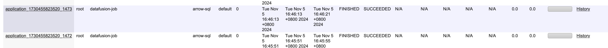

# arrow-sql-yarn

arrow-sql-yarn可以让[datafusion](https://datafusion.apache.org/user-guide/sql/index.html)和[polars](https://pola.rs/)在yarn master上运行

## 提交方式

### shell
* job 配置json sql
* yarn master_memory内存为yarn master与job内存之和

```shell
yarn jar /mnt/dss/arrow-sql-yarn-1.0.0.jar com.on.yarn.Client \
  -jar_path oss://canary-lb-bi-presto-config/datax/tmp/arrow-sql-yarn-1.0.0.jar \
  -appname datafusion-job \
  -master_memory 1120 \
  -queue default \
  -job /mnt/dss/job_polars.sql 
```

### sdk api(scala)

* JobLogger类型重写com.on.yarn.base.YarnManipulator日志输出接口
* Job中传入运行参数sql文件地址
* 引入以下依赖

```xml

<dependency>
    <groupId>com.on.yarn</groupId>
    <artifactId>arrow-sql-yarn</artifactId>
    <version>1.0.0</version>
</dependency>
```

```scala
val jobLogger = new JobLogger(job)
var client: Client = null
try {
  val cmd = dataxJob.toStrinArray
  jobLogger.info("------------------运行参数: " + ArrayUtil.toString(cmd))
  client = new Client(jobLogger)
  if (!client.init(cmd)) throw new RuntimeException("参数初始化异常: " + dataxJob)
  val applicationId: ApplicationId = client.run
  appId = applicationId.toString
  jobLogger.info("------------------DataX yarn id: " + applicationId.toString)
  val result = client.monitorApplication(applicationId)
  if (result) jobLogger.info("Application completed successfully")
  else throw new RuntimeException("任务运行异常,详见日志,AppID: " + applicationId)
} catch {
  case e: Exception => {
    jobLogger.info(ExceptionUtil.stacktraceToString(e))
  }
} finally {
  if (null != client) client.stop()
}

```

## 运行示例


